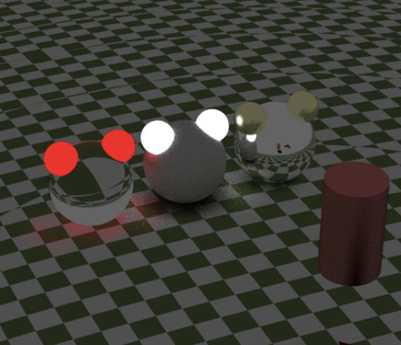

<a id="readme-top"></a>

<!-- PROJECT LOGO -->
<br />
<div align="center">
  <a href="https://github.com/komskoms/mini-RT-engine">
    
  </a>

  <h3 align="center">miniRayTracer</h3>

  <p align="center">
    Cute graphic engine based on ray-tracing modeling
    <br />
    <br />
    
    <br />
  </p>
</div>
<br />

<!-- TABLE OF CONTENTS -->
<details>
  <summary>Table of Contents</summary>
  <ol>
    <li>
      <a href="#what-is-this">What is this</a>
      <ul>
        <li><a href="#description">Description</a></li>
    	<li><a href="#constraint">Constraint</a></li>
      </ul>
    </li>
    <li>
      <a href="#getting-started">Getting Started</a>
      <ul>
        <li><a href="#prerequisites">Prerequisites</a></li>
        <li><a href="#installation">Installation</a></li>
      </ul>
    </li>
    <li><a href="#member">Member</a></li>
    <li><a href="#license">License</a></li>
  </ol>
</details>

<!-- ABOUT THE PROJECT -->
<br />

## What is this

---

<!-- 간단한 프로젝트 설명 -->

miniRT는 C로 작성된 기초적인 그래픽 엔진입니다.

<br />

### Description

    raytracing 기법을 사용하여, 물리적으로 정확하고 사실적인 이미지를 생성합니다.
    정해진 서식으로 배경, 물체 및 물체의 속성, 시점을 설정하고, 프로그램은 이 정보를 이용해 물리적으로 적절한 이미지를 생성합니다.
    물체의 속성은, 투명(유리), 발광체, 전반사(거울), 난반사(반사정도 조절 가능)이 있습니다.

<br />

### Objects
프로젝트에서 달성하고자 한 기능들

> - 
> - (기타 기능 설명)
> - 메모리 릭이 발생해선 안됩니다.
> - 사용자의 어떤 조작에도 처리되지 않은 에러나, 비정상적인 종료가 발생해선 안됩니다.

<p align="right"><a href="#readme-top">back to top</a></p>

## Getting Started

### Prerequisites

1. linux 혹은 mac 환경에서만 이용 가능합니다.

2. gcc와 make가 설치되어 사용가능한 환경이어야 합니다.

<br />

### Installation

1. clone the project

```sh
  git clone https://github.com/komskoms/mini-RT-engine
```

2. compile the source at the root of the project path

```sh
  cd mini-RT-engine && make all
```

3. run the promgram

```sh
  ./miniRT [scene file]
```

<p align="right"><a href="#readme-top">back to top</a></p>

<br/>
<!-- LICENSE -->

## License

해당 프로젝트는 [MIT 라이센스](https://github.com/komskoms/mini-RT-engine/blob/main/LICENSE)를 기반으로 두고 있습니다.

<p align="right"><a href="#readme-top">back to top</a></p>
